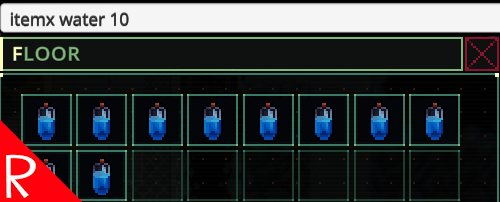

# Quasimorph Spawn Multiple Items Command

Executes the console's item command multiple times to drop more than one item.

Ex:
`itemx water 10`

Will drop 10 water bottles.

Note that this command will not stack items as it simply invokes the game's item command multiple times.

# Support
If you enjoy my mods and want to buy me a coffee, check out my [Ko-Fi](https://ko-fi.com/nbkredspy71915) page.
Thanks!

# Source Code
Source code is available on GitHub at https://github.com/NBKRedSpy/QM_SpawnMultipleCommand
