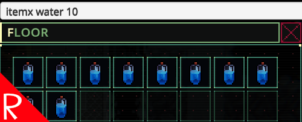

# Item Command Extended

**WARNING**: Using console commands will disable achievements.

An extended version of the game's `item` console command. 
It supports autocomplete and provides an error message when an ID is not valid.

Usage:
`itemx water 10`

Will drop 10 water bottles.

Note that this command will not stack items as it simply invokes the game's item command for actual item creation.

# Auto Complete
Type itemx, a partial id, and then hit tab.  All id matches will be returned.  The up and down arrow keys can be used to select a suggestion.

# Support
If you enjoy my mods and want to buy me a coffee, check out my [Ko-Fi](https://ko-fi.com/nbkredspy71915) page.
Thanks!

# Source Code
Source code is available on GitHub at https://github.com/NBKRedSpy/QM_SpawnMultipleCommand

## 1.3.0
* 0.9.9's `item` command now supports count.  Relaying to that.
* Added Item ID check since the game's `item` command silently fails with a bad id.

## 1.2.0
* Added auto complete.

## 1.1.0
* Version 0.8.6 compatibility
